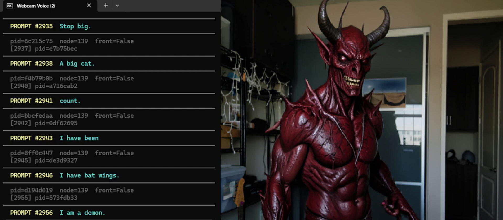

# 🎙️ Webcam Voice i2i

> **Speak a prompt. See it rendered in real time.**  
> Your voice drives a live FLUX2 img2img loop in ComfyUI — webcam feed in, AI-styled frames out, updating continuously as you talk.


---

## ✨ What It Does

| Input | → | Output |
|---|---|---|
| 🎤 Your voice | Whisper transcription | Text prompt |
| 📷 Webcam feed | OpenCV frame capture | Reference image |
| Both together | FLUX2 in ComfyUI | AI-styled frames at ~3–4 fps |

- **Speak** and the prompt updates live — ComfyUI interrupts the current generation and starts the new one instantly
- **Stay silent** and it keeps generating with your last spoken prompt
- **Preview window** pops up automatically showing each generated frame

---

## 📺 Video Walkthrough

[](https://youtu.be/AeFrtXBMLLo?si=fm9QwUX7XzjwGnF5)

---

## 🎬 See It In Action

> *Saying "I am a demon" live — prompt #2956, generation ~2955 frames in.*



---

## 🖥️ Requirements

Before you begin, make sure you have:

- [ ] **Windows 10 or 11**
- [ ] **Python 3.10 or newer** — [download here](https://www.python.org/downloads/) *(check "Add to PATH" during install)*
- [ ] **ComfyUI** installed and working — [ComfyUI on GitHub](https://github.com/comfyanonymous/ComfyUI)
- [ ] **FLUX2 Klein workflow** loaded in ComfyUI (`optimized_flux2_klein_512_v02.json`)
- [ ] **A microphone** plugged in and set as your Windows default mic
- [ ] **A webcam** plugged in

> 💡 A CUDA GPU is strongly recommended for ComfyUI. Whisper runs fine on CPU.

---

## 🔧 First-Time Setup

*You only need to do this once.*

**1. Clone or download this repo** into a folder on your computer.

**2. Double-click `setup.bat`**

This will:
- Create a Python virtual environment (`.venv` folder)
- Install all required packages automatically

That's it. Setup is done.

---

## 🚀 How to Run — Every Single Time

> **Follow this order exactly.** The startup sequence matters.

### Step 0 — Kill any stale Python processes (if needed)

If the script previously crashed or was force-closed, a `python.exe` process may still be holding the camera. Run this in PowerShell before starting:

```powershell
Get-Process python* | Stop-Process -Force
```

---

### Step 1 — Start ComfyUI

Go to your ComfyUI folder and double-click your launcher (usually `run_nvidia_gpu.bat`).

Wait until you see this line in the ComfyUI window:
```
To see the GUI go to: http://127.0.0.1:8188
```
✅ ComfyUI is ready.

> ⚠️ **ComfyUI's launcher automatically opens Chrome.  Close that browser window immediately** — before running `start.bat`.  If Chrome stays open, its WebcamCapture node will grab the camera first and lock out the Python script.

---

### Step 2 — Double-click `start.bat` in this folder

The script will:
1. Activate the Python environment automatically
2. Wait and detect ComfyUI is running (retries every 4 seconds — no need to do anything)
3. Open your webcam
4. Load the Whisper voice model
5. Start generating

You'll see this in the console when everything is live:
```
[CAM] Opened device 0 via MSMF
[INFO] Whisper listening. Speak to drive the prompt.
[INFO] Feedback strength: 0.700  (press [ for more memory/ghosting, ] for more live/responsive, 1 = fully live, 0 = max ghosting)
>>> PROMPT [0]  'The Easter Bunny'
    pid=ae8a9d2c  node=139  front=False
```
A **"ComfyUI Output"** preview window will pop up showing generated frames.

> 🎛️ **Tune temporal feedback live** — click the preview window so it has focus, then press
> `[` / `]` to lower/raise feedback strength, `1` to jump to fully live (no memory), or `0` to
> jump to maximum ghosting. See [Temporal Feedback](#-temporal-feedback) below for what this
> actually controls.

---

### Step 3 — Open your browser (optional, for monitoring)

Once `start.bat` is running and you can see the preview window, you can open Chrome/Edge to `http://127.0.0.1:8188` to watch ComfyUI's queue and gallery.

> ✅ At this point Python already owns the camera, so the browser can't interfere.

---

### Step 4 — Speak!

- **Talk naturally** — speech is detected continuously, chunk by chunk
- **Silence** = ComfyUI keeps running with the last prompt you spoke
- **New words** = finish your phrase and pause briefly (~0.6s by default) — that pause marks the utterance as complete, and ComfyUI interrupts and switches to your new prompt immediately
- The console shows every prompt change:
  ```
  >>> PROMPT [42]  'cinematic neon rain, noir city street at night'
  ```

### Step 5 — Stop

Press **`Ctrl+C`** in the console window. Everything shuts down cleanly.

---

## ⚙️ Configuration

All settings live in **`config.yaml`**. Open it in Notepad, change the numbers, save the file, then restart `start.bat` — it reads the config fresh on every launch.

| Setting | Default | What it does |
|---|---|---|
| `comfyui.host` | `http://127.0.0.1:8188` | Address of your ComfyUI server |
| `comfyui.workflow_json` | `workflows/...v02.json` | Which workflow file to use |
| `whisper.model` | `base` | Whisper model size. `tiny` = fastest, `large-v2` = most accurate |
| `whisper.device` | `auto` | `cuda` for GPU, `cpu` for CPU, `auto` detects |
| `audio.silence_threshold` | `0.01` | Per-chunk RMS below this = silence. Raise if idle noise triggers false speech, lower (even `0.0`) if quiet speech gets missed |
| `audio.min_speech_ms` | `150` | How much continuous speech is required before an utterance is considered "started" |
| `audio.min_silence_ms` | `600` | How long a pause must last before an utterance is considered finished and sent for transcription |
| `audio.max_utterance_ms` | `8000` | Force-flushes long monologues so the prompt still updates even if you don't pause |
| `webcam.device_index` | `0` | `0` = default webcam. Try `1` or `2` if the wrong camera opens |
| `webcam.width` / `height` | `512` | Capture resolution — match your workflow's latent size |
| `display.interpolate` | `true` | Inserts an OpenCV optical-flow midframe between real outputs to smooth perceived fps |
| `feedback.enabled` | `true` | Turns the temporal feedback loop on/off (see below) |
| `feedback.strength` | `0.7` | Starting `blend_factor` — weight on the live webcam frame. See [Temporal Feedback](#-temporal-feedback) |
| `feedback.step` | `0.02` | How much each `[` / `]` keypress changes the strength while running |
| `nodes.prompt_node_id` | `139` | Node ID of the CLIPTextEncode (positive prompt) in your workflow |
| `nodes.feedback_node_id` | `154` | Node ID of the LatentBlend node used for temporal feedback |

---

## 🌀 Temporal Feedback

Each new frame's latent is blended with the *previous output's* latent (ComfyUI node 154,
`LatentBlend`) before decoding. This is what gives the output frame-to-frame stability instead
of every frame looking like an unrelated re-roll.

`feedback.strength` (the node's `blend_factor`) is the weight on the **current/live** webcam
frame:

- **`1.0`** — pure live frame, no memory at all (every frame independent)
- **`0.7`** (default) — mostly live, a bit of carry-over for stability
- **`0.0`** — ignores the live frame entirely; loops on the previous output (maximum ghosting)

Lower values trade responsiveness for smoothness; if it feels "over-baked" or laggy behind your
movement, raise the strength. If frames feel too flickery/independent, lower it. Tune it live
with `[` / `]` / `0` / `1` in the preview window — no restart needed, changes apply to the very
next frame.

---

## 🛠️ Troubleshooting

### ❌ `Connection refused at http://127.0.0.1:8188`
ComfyUI isn't running. Start it first, then `start.bat` will detect it automatically.

---

### ❌ `Cannot open webcam device 0`
Your camera is locked by another application.

**Most likely cause:** ComfyUI's launcher auto-opens Chrome, which grabs the camera. Close that browser window right after ComfyUI starts, before running `start.bat`.

**If a previous run crashed**, a stale `python.exe` may still hold the lock. Kill it:
```powershell
Get-Process python* | Stop-Process -Force
```

Quick test — run this in your `.venv` to confirm the camera is free:
```
.venv\Scripts\activate
python -c "import cv2; cap=cv2.VideoCapture(0,cv2.CAP_MSMF); print('OK' if cap.read()[0] else 'LOCKED'); cap.release()"
```
If it prints `LOCKED`, close the browser (or kill python) and try again.

If you have multiple cameras, try `device_index: 1` or `2` in `config.yaml`.

---

### ❌ Whisper isn't picking up my voice
- Check that your microphone is set as the **Windows default recording device** (right-click the speaker icon in taskbar → Sound Settings → Input)
- Try speaking louder — `silence_threshold: 0.01` filters very quiet audio
- Set `silence_threshold: 0.0` in `config.yaml` to disable the filter entirely

---

### ❌ Prompt only captures the first 2–3 words of a phrase
Whisper is committing the utterance before you've finished speaking — usually because a short
natural pause mid-sentence is being read as the end of speech.

**Fix:** Raise `min_silence_ms` in `config.yaml` (try `900` or `1200`). This is how long a pause
must last before your utterance is considered finished and sent to Whisper — longer values give
you more room for mid-sentence breaths.

If long phrases get cut off instead, raise `max_utterance_ms` (try `12000`).

---

### ❌ Prompts keep changing when I'm not talking (hallucinations)
Whisper sometimes transcribes background noise or computer sounds.

**Fix:** Increase `silence_threshold` in `config.yaml` (try `0.02` or `0.03`) until idle transcriptions stop.

---

### ❌ Generation is slow / not reaching 3–4 fps
- Make sure ComfyUI is using your GPU (check its console for `cuda` device messages)
- The workflow uses only 2 sampler steps — don't increase this
- Try `whisper.model: tiny` in `config.yaml` to reduce CPU load from transcription

---

### ❌ Preview window doesn't appear
The output window uses OpenCV. If it doesn't appear, check that `opencv-python` installed correctly:
```
.venv\Scripts\activate
python -c "import cv2; print(cv2.__version__)"
```
If that fails, run `setup.bat` again.

---

## 📁 File Overview

```
webcam-voice-i2i/
├── start.bat           ← Double-click to run (after ComfyUI is started)
├── setup.bat           ← One-time install
├── main.py             ← Main loop: voice + webcam → ComfyUI
├── audio_capture.py    ← Whisper transcription thread
├── comfy_client.py     ← ComfyUI REST + WebSocket API client
├── webcam_grabber.py   ← OpenCV webcam capture
├── config.yaml         ← All settings (edit this to customize)
├── requirements.txt    ← Python dependencies
├── cam_vox_i2i_02.jpg  ← Demo screenshot (README)
└── workflows/
    └── optimized_flux2_klein_512_v02.json   ← ComfyUI workflow (API format)
```

---

## 🎤 What to Say — Prompt Ideas

Short, punchy phrases work best. Try these to get started:

| Category | Examples |
|---|---|
| **Scene** | `the background is on fire` · `everything is underwater` · `inside a blizzard` |
| **Material** | `I am made of glass` · `I am made of gold` · `I am made of obsidian` |
| **Lighting** | `only candlelight` · `lit by neon signs` · `moonlight only` |
| **Style** | `oil painting style` · `charcoal sketch` · `film noir black and white` |
| **Character** | `I am a skeleton` · `I am a cyborg` · `I am a ghost` |
| **Combos** | `robot in a burning forest at night` · `I am made of glass inside a thunderstorm` |

📄 **[Full prompt list → PROMPTS.md](PROMPTS.md)** — 100+ phrases organized by category, with tips on what works with this model.

---

## 💡 Tips

- **Best prompts** are short and descriptive: *"oil painting portrait, warm light"* or *"cyberpunk city, neon rain, cinematic"*
- The **positive prompt node** (139) gets your voice text. The negative prompt (node 140) is empty by default — you can set it manually in `config.yaml` if needed
- To use a **different workflow**, export it from ComfyUI as API format, drop it in `workflows/`, and update `workflow_json` in `config.yaml`. Also check the node IDs match

---

*Built on [faster-whisper](https://github.com/SYSTRAN/faster-whisper) · [ComfyUI](https://github.com/comfyanonymous/ComfyUI) · [OpenCV](https://opencv.org/)*
